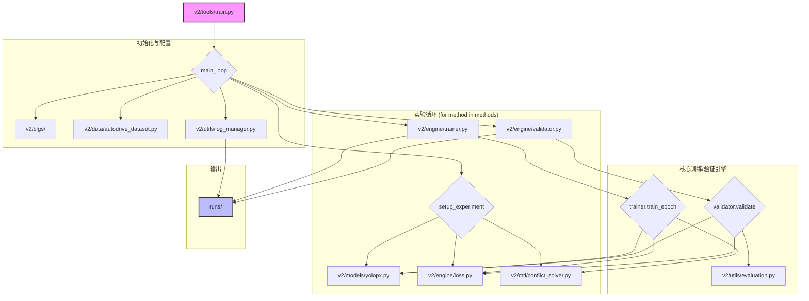

# Phoenix 项目 - 文件数据流分析

**版本:** 2.0
**日期:** 2025-07-29
**分析起点:** `v2/tools/train.py`

---

## 1. 高层数据流图

这是一个简化的、描述核心训练流程的数据流图（基于 `v2` 版本）：

---

## 2. 核心文件描述 (V2)

### 目录: `v2/`

*   **`v2/tools/train.py`**: **总指挥/启动器**。负责解析参数，设置实验，并调用 `Trainer` 和 `Validator`。
*   **`v2/engine/trainer.py`**: **训练引擎**。负责单个 epoch 的训练循环，包括前向传播、损失计算和在调用冲突求解器后的反向传播。
*   **`v2/engine/validator.py`**: **验证引擎**。负责评估模型性能，计算 mAP, mIoU 等指标。
*   **`v2/mtl/conflict_solver.py`**: **梯度策略求解器**。实现多种梯度冲突解决策略（PCGrad, CAGrad 等）的核心模块。
*   **`v2/models/yolopx.py`**: **模型构造工厂**。基于配置文件动态构建 YOLOPX 神经网络。
*   **`v2/engine/loss.py`**: **损失函数中心**。定义并组合用于三个任务的损失函数。
*   **`v2/data/autodrive_dataset.py`**: **数据加载与预处理**。负责从 `bdd100k` 数据集加载和增强数据。
*   **`v2/cfgs/`**: **全局配置中心**。存放所有模型、训练和数据的配置文件。

---

## 3. 文件夹功能总结

*   **`v1/`**: 旧版研究代码，用于历史复现。
*   **`v2/`**: 当前的核心实验平台，代码经过重构，模块化且易于扩展。
*   **`runs/`**: 所有实验产物（日志、权重、图片）的统一输出目录。

---

## 4. 文档关系说明

为了清晰地管理项目，不同 Markdown 文件各司其职：

*   **`README.md`**: **项目入口和高层概述**。
    *   **读者**: 任何初次接触本项目的成员。
    *   **目的**: 快速了解项目的目标、研究方法、最终的代码结构和如何开始一个实验。
    *   **内容**: 项目主旨、方法论、代码结构、环境配置和启动命令。

*   **`report.md`**: **研究进展与实验报告**。
    *   **读者**: 项目核心研究人员。
    *   **目的**: 记录详细的实验设计、过程、结果和分析。这是一个动态更新的文档，反映了研究的进展。
    *   **内容**: 详细的实验设置、数据分析、图表、消融研究和结论。

*   **`files_flow.md`** (本文档): **代码结构与数据流**。
    *   **读者**: 需要深入理解代码实现细节的开发者。
    *   **目的**: 提供一个代码层面的导览，解释核心模块如何协同工作。当需要修改或扩展代码时，应首先查阅此文档。
    *   **内容**: 核心文件和目录的功能描述，以及描述它们之间交互关系的数据流图。